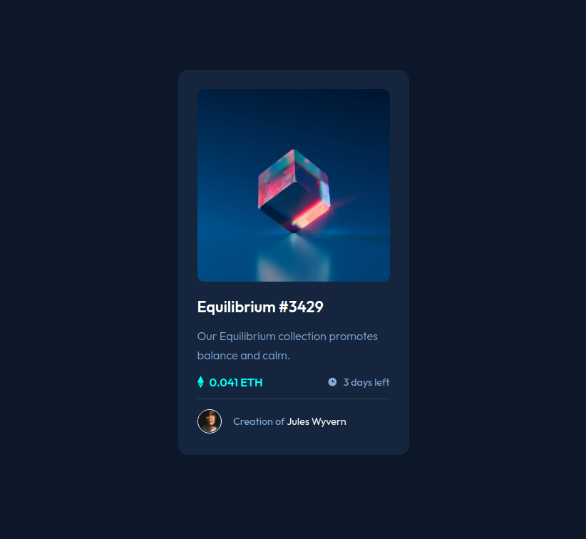

# Frontend Mentor - Product preview card component solution

## Table of contents

- [Overview](#overview)
  - [Screenshot](#screenshot)
  - [Links](#links)
- [My process](#my-process)
  - [Built with](#built-with)
  - [What I learned](#what-i-learned)
  - [Continued development](#continued-development)
- [Author](#author)

---

## Overview

### Screenshot

### Links

- Solution URL: https://github.com/JojoRider/FEM-NFT_preview_card_component
- Live Site URL: https://jojorider.github.io/FEM-NFT_preview_card_component/

---

## My process

1. Analyse of the design schema to identify the different sections and how to built the right sections in the HTML file
2. First version of sections and classes
3. Starting of building the style in CSS, from top to bottom. Fist version was fully built but had not the hovering effect on the main picture.
4. Do some research to build the line, and how to create the hovering effect as requested. Line was a breeze, but I spent litteraly hours to find how to make the pictures work. I tried many things, with more or less results and finally found a solution with the help of Vanza Setia, a fellow Frontend Mentor member
5. Fine tuning and improvement of the hovering effect for the text elements

### Built with

- Semantic HTML5 markup
- CSS custom properties
- Flexbox
- Desktop first

### What I learned

- Build a line with HTML
- Position relative / absolute
- Usage of anchors tags
- Pseudos elements

### Continued development

This project was very interesting, and honestly, I didn't think to encounter such a challenge for the main picture...

I understand now the concept behind it and for the relative/absolute positioning but definitely need to learn/practice more on these topics.

---

## Author

- Frontend Mentor - [@JojoRider](https://www.frontendmentor.io/profile/JojoRider)

---

## Acknowledgments

Big thanks to Vanza Setia, for his solution proposal!